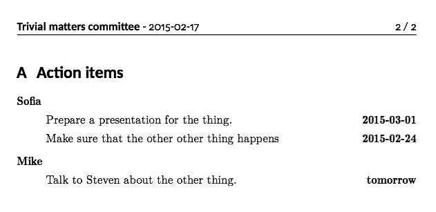

# sticky.tex

This is a collection of LaTeX classes and styles in use at Study Association Sticky.
They are intended for use in minutes of committees and other meetings.

## Versioning

The classes in this package follow [`semver`](http://semver.org/).

## Dependencies

These files require LaTeX2e. Older versions are not supported.

`sticky_typography.cls` dependencies:

 - `titlesec`
 - `bitstream-charter`
 - `carlito`
 - `fontenc`

`sticky_minutes.cls` dependencies:

 - `sticky_typography`
 - `xspace`
 - `fancyhdr`
 - `lastpage`
 - `multido`
 - `multido`

## Installation

Make sure you have the dependencies installed. After that there are two ways of
installing these styles:

 1. Put the `.cls` files in the same directory as your `.tex` file, you're done. Easy
    for simple, one-off documents.
 1. Install these classes in your `TEXFHOME`. This is more involved, but after you
    have done this, you never have to copy the style files again.

### `TEXFHOME` installation

Run the following command to find your `TEXFHOME`. This should work both on Windows
and UNIX-y systems.

```
kpsewhich -var-value=TEXMFHOME
```

This will probably show a value like `C:/Users/<user>/texmf` or `~/texmf`. Place the
files you want in `TEXMFHOME/tex/latex/commonstuff`. Create the directory if you must.

For example, if your `TEXMFHOME` is `C:/Users/duijf/texmf`, you should place the `.cls`
files in `C:/Users/duijf/texmf/tex/latex/commonstuff`. After that, they should get
picked up. You can verify the installation with the `kpsewhich` command. For example:

```
kpsewhich sticky_minutes.cls
```

## Usage

Here is a basic document that shows off the basic package API:

```latex
\documentclass[a4paper]{sticky_minutes}
% Set the document language. The sticky_minutes.cls file supports Dutch and English
\usepackage[english]{babel}

% Set the metadata of the meeting:
\committee{Trivial matters committee}
\members{John Doe, Mike Smith, Mark Williams, Sofia Thompson, Emily Young, Amanda Walker}
\absent{Mike Smith}
\guests{Maria Scott}
\notetaker{Sofia Thompson}
\date{2015-02-17}

\begin{document}

\header

\section{Opening}

The chairman opens the meeting on 15:01.

\section{Announcements}

Emily says [..]

Mark tells [..]

\section{Open issues}

Lorem ipsum dolor sit amet, consectetur adipiscing elit. Donec interdum felis nec dui
cursus, vitae tempor urna volutpat. Donec pretium dapibus lacus, et molestie felis
convallis eget.

\action{Sofia}{2015-03-01}{Prepare a presentation for the thing.}

Nunc nec erat dictum mi varius finibus. Phasellus porta fermentum eros
a iaculis. Quisque viverra, justo a laoreet consequat, eros metus pretium velit, sit
amet blandit lorem enim non tellus.

\action{Mike}{tomorrow}{Talk to Steven about the other thing.}

Fusce facilisis at tellus ut tempor. Curabitur eleifend augue eu lorem molestie
semper. Sed fringilla laoreet malesuada. Sed vulputate blandit orci, sit amet
pellentesque ante lacinia id. Pellentesque ac tortor egestas, gravida nibh ut,
dapibus est. In dapibus tristique enim non accumsan. Nulla vulputate lacus in lorem
mattis hendrerit.

\action{Sofia}{2015-02-24}{Make sure that the other other thing happens}

\section{Closing}

The chairman closes the meeting at 16:30.

\appendix
\actionlist

\end{document}
```

The above can also be found in `demo.tex`. This will produce a document with an
action list as appendix that sorts the action items per person as seen here:



## API reference

Here is a list of all of the commands that are intended for author use in this
package.

<dl>
  <dt><code>\committee{}</code></dt>
  <dt>Dutch: <code>\commissie</code> <code>\orgaan</code></dt>
  <dd>The name of the committee of the minutes.</dd>

  <dt><code>\members{}</code></dt>
  <dt>Dutch: <code>\leden</code></dt>
  <dd>The members of the committee.</dd>

  <dt><code>\absent{}</code></dt>
  <dt>Dutch: <code>\afwezig</code></dt>
  <dd>The persons that are absent.</dd>

  <dt><code>\guests{}</code></dt>
  <dt>Dutch: <code>\gasten</code></dt>
  <dd>Guests to the meeting</dd>

  <dt><code>\notetaker{}</code></dt>
  <dt>Dutch: <code>\notulist</code></dt>
  <dd>The author of the meeting minutes.</dd>

  <dt><code>\date{}</code></dt>
  <dt>Dutch: <code>\datum</code></dt>
  <dd>The date of the meeting.</dd>

  <dt><code>\action{}{}{}</code></dt>
  <dt>Dutch: <code>\ap</code></dt>
  <dd>Records an action item for a person.</dd>

  <dt><code>\actionlist</code></dt>
  <dt>Dutch: <code>\actiepunten</code></dt>
  <dd>Prints a sorted action list of the meeting.</dd>
</dl>

## License

MIT with parts of the code under CC-BY-SA 3.0 unported because of their origin on
Stack Exchange. These sections are marked by comments, where you will also find
attribution. In the future the full list will be in this README as well.

See `LICENSE.md` for the MIT license and [here][cc-by-sa] for the relevant Creative
Commons License.

  [cc-by-sa]:https://creativecommons.org/licenses/by-sa/3.0/
